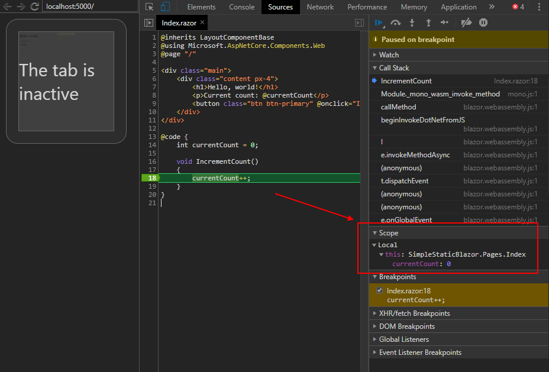

# SimpleStaticBlazor
## Publish

`dotnet publish -c release`

## Docker

`docker build -t simplestaticblazor .`
`docker run -it --rm -p 5000:80 simplestaticblazor`

## Debugging

`dotnet run -c debug`

`Close all Chrome instances` and press `Windows` + `R`

`"%programfiles(x86)%\Google\Chrome\Application\chrome.exe" --remote-debugging-port=9222 http://localhost:5000/`

`Shift` + `Alt` + `D`

